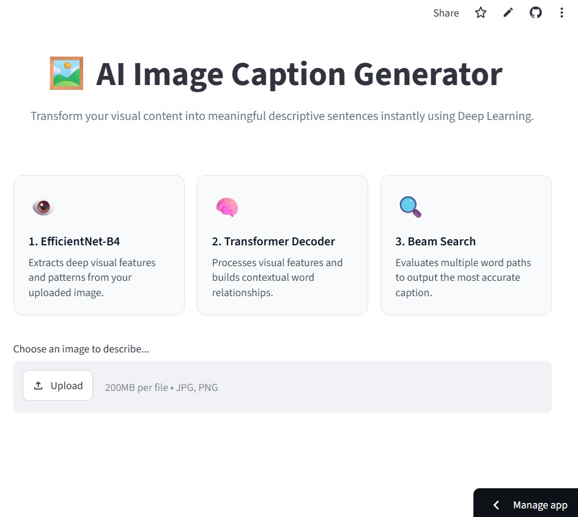

# 🖼️ AI Image Caption Generator
An end-to-end Deep Learning application that automatically generates descriptive, natural-language captions for any uploaded image. This project combines a **Computer Vision backbone (EfficientNet-B4)** for deep feature extraction with a **Natural Language Processing decoder (Transformer Decoder)**, wrapped in an interactive **Streamlit web application**.

## 🌐 Live Web Application
Experience the model in action without any local setup. The web interface features single-image queue management, responsive UI design cards, and instant caption rendering:
**[Launch Live Demo on Streamlit Cloud](https://caption-image.streamlit.app/)**

## 🚀 Project Overview & Architecture

The architecture bridges visual perception and language modeling. Instead of processing raw pixels sequentially, the model follows a two-stage encoder-decoder paradigm:
1. **Visual Encoder (EfficientNet-B4):** Extracts a dense, high-dimensional vector representation ($1792$-dimensional) capturing complex textures, edges, objects, and spatial hierarchies from the image.
2. **Textual Decoder (Transformer Decoder):** Acts as a language model that attends to the visual memory tokens and autoregressively generates words using causal multi-head self-attention.

3. ## 🛠️ Tech Stack & Dependencies

*   **Deep Learning Framework:** `PyTorch 2.2.1`, `Torchvision 0.17.1`
*   **Image Processing & UI:** `Pillow 10.2.0`, `Streamlit 1.32.0`
*   **Utilities:** `Numpy 1.26.4`, `Pickle`

*   ## 📁 Project Directory Structure

```text
image-caption-generator/
│
├── weights/
│   ├── transformer_image_captioning_effnet.pth  # Trained Transformer weights
│   └── vocab.pkl                                # Serialized Vocabulary mapping
│
├── feature_extractor.py                         # EfficientNet-B4 backbone & preprocessing
├── model.py                                     # Transformer decoder, Positional Encoding, .fit(), & .predict()
├── streamlit_app.py                             # Interactive Streamlit frontend web app
└── requirements.txt                             # Project python dependencies
```
---

## 📊 End-to-End Pipeline

### 1. Data Collection & Preprocessing
*   **Dataset Source:** Standard image-captioning benchmarks (such as [Flickr8k](https://www.kaggle.com/datasets/adityajn105/flickr8k) or MS COCO).
*   **Image Pipeline:** Images are resized and center-cropped to $380 \times 380$ resolution (required by EfficientNet-B4) and normalized using ImageNet statistics ($\text{mean} = [0.485, 0.456, 0.406]$, $\text{std} = [0.229, 0.224, 0.225]$).
*   **Text Pipeline:** Captions are tokenized, cleaned, and mapped to integer sequences using a custom `Vocabulary` class incorporating special tokens: `<pad>`, `<start>`, `<end>`, and `<unk>`.

### 2. Model Training (`.fit()`)
*   The model optimizes cross-entropy loss between predicted vocabulary logits and target token sequences using teacher forcing.
*   **Optimizer & Scheduler:** Managed via the `Adam` optimizer (initial learning rate $3\times10^{-4}$) paired with a `ReduceLROnPlateau` learning rate scheduler to stabilize convergence.

### 3. Inference & Generation (`.predict()`)
*   During inference, the image is passed through the frozen `FeatureExtractor` to obtain the $1792$-dimensional vector.
*   The `TransformerImageCaptioning` model uses **Beam Search** ($width = 3$) to explore multiple potential text sequences simultaneously, ensuring the most coherent and syntactically correct caption is chosen.

### 4. User Interface & Streamlit Web App
* **Live Web Preview:**
  
